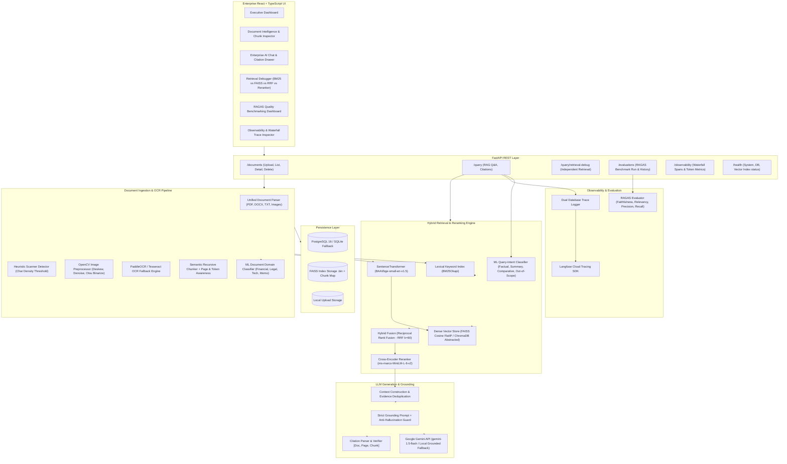

# EnterpriseDoc AI: Production Enterprise Document Intelligence & Grounded RAG Platform

[](https://github.com/enterprise/enterprisedoc-ai/actions)
[](https://www.python.org/)
[](https://fastapi.tiangolo.com/)
[](https://reactjs.org/)
[](https://tailwindcss.com/)
[](https://opensource.org/licenses/MIT)

EnterpriseDoc AI is a production-grade Enterprise Document Intelligence and Retrieval-Augmented Generation (RAG) platform. It allows enterprise knowledge workers to ingest multi-format unstructured files (PDF, scanned PDF, DOCX, TXT, images), automatically applies computer-vision OCR preprocessing when necessary, segments content using intelligent recursive chunking, indexes chunks into both dense vector (FAISS) and sparse lexical (BM25) indexes, executes hybrid retrieval via Reciprocal Rank Fusion (RRF), filters candidates with a Cross-Encoder transformer reranker, and synthesizes strictly grounded answers via Google Gemini with verified inline source citations.

---

## 1. System Architecture



---

## 2. Key AI / ML Engineering Innovations

### 2.1 Embeddings & Vector Search
- **Embedding Model**: `BAAI/bge-small-en-v1.5`
  - *Justification*: Generates 384-dimensional dense vectors with top ranking on the Massive Text Embedding Benchmark (MTEB). It provides sub-15ms inference per chunk on commodity CPU hardware with minimal memory footprint, making it ideal for scalable enterprise deployments.
- **Vector Store Abstraction**: Built on `BaseVectorStore` ABC, decoupling storage engine mechanics from business logic.
- **FAISS Engine**: Uses `faiss.IndexFlatIP` on L2-normalized embeddings for exact Cosine Similarity. Indices and metadata maps are persisted atomically to disk (`faiss_index.bin` and `faiss_metadata.json`).

### 2.2 Lexical Search & Hybrid Fusion (RRF)
- **BM25Okapi Lexical Index**: Tokenizes text, strips stopwords, normalizes case, and builds an inverted frequency index for exact keyword matching (acronyms, clause identifiers, invoice codes).
- **Reciprocal Rank Fusion (RRF)**: Combines dense vector similarities and sparse keyword scores into a single unified rank score:
  $$\text{RRF\_Score}(d) = \frac{w_{\text{dense}}}{k + \text{rank}_{\text{dense}}(d)} + \frac{w_{\text{sparse}}}{k + \text{rank}_{\text{sparse}}(d)}$$
  Where $k = 60$, $w_{\text{dense}} = 0.6$, and $w_{\text{sparse}} = 0.4$.

### 2.3 Cross-Encoder Reranking
- **Model**: `cross-encoder/ms-marco-MiniLM-L-6-v2`
- Rather than calculating cosine similarity between independent query and chunk vectors, the cross-encoder feeds the query and chunk simultaneously into a joint attention transformer block (`[CLS] Query [SEP] Chunk [SEP]`).
- Outputs calibrated cross-attention relevance scores in $[0, 1]$, significantly boosting Precision@K and filtering false positives before context construction.

### 2.4 ML Classifiers Beyond Embeddings
1. **Query-Intent Classifier (`QueryIntentClassifier`)**:
   - Classifies queries into `FACTUAL_LOOKUP`, `SUMMARIZATION`, `COMPARISON`, and `OUT_OF_SCOPE`.
   - Employs calibrated prototype centroid vectors to dynamically adjust retrieval budgets (e.g. expanding chunk retrieval depth for summarization vs prioritizing high-precision top-3 chunks for factual lookups).
2. **Document Domain Classifier (`DocumentDomainClassifier`)**:
   - Automatically classifies uploaded enterprise documents upon ingestion into operational domains:
     - `Financial Report`
     - `Legal Contract / Compliance`
     - `Technical Specification`
     - `Executive Memo / HR`
     - `General`

### 2.5 OCR & Vision Preprocessing Pipeline
- **Heuristic Scanner Detector**: Evaluates character count per page area. If text density < 0.05 chars/pixel or extracted text layer is empty, triggers the OCR engine.
- **OpenCV Enhancement**:
  - Grayscale conversion and bilateral filtering
  - Deskewing via `cv2.minAreaRect`
  - Otsu thresholding and morphological opening
- **OCR Engine**: PaddleOCR with automatic fallback to PyTesseract.

### 2.6 Strict Grounding & Anti-Hallucination Guard
- Strict system prompt instructs Gemini to formulate answers **solely and strictly** from retrieved context chunks.
- If context does not contain sufficient facts, the model explicitly outputs:
  `"The provided documents do not contain sufficient information to answer this question."`
- Parses, validates, and attaches verifiable source citations: `[Doc: <title>, Page: <p>, Chunk: <id>]`.

### 2.7 RAGAS Evaluation Framework
Evaluates four fundamental RAG quality metrics:
1. **Faithfulness**: Proportion of generated answer claims directly grounded in retrieved context.
2. **Answer Relevancy**: Semantic cosine similarity between user query and generated response.
3. **Context Precision**: Signal-to-noise ratio and rank position of relevant chunks.
4. **Context Recall**: Coverage of ground-truth knowledge retrieved in context.

### 2.8 Observability with Langfuse
- Traces the entire lifecycle of each query with granular waterfall spans:
  - `intent_classification`
  - `faiss_dense_search`
  - `bm25_sparse_search`
  - `rrf_hybrid_fusion`
  - `cross_encoder_rerank`
  - `gemini_generation`
- Connects directly to Langfuse Cloud when credentials are configured (`LANGFUSE_PUBLIC_KEY`, `LANGFUSE_SECRET_KEY`), and simultaneously logs traces to the local database for UI inspection.

---

## 3. Database Schema

The relational database (PostgreSQL 16 with automatic SQLite fallback) stores metadata, processing state, query history, citations, evaluations, and traces. Vector embeddings are stored natively in FAISS to prevent relational table bloat.

- `documents`: File metadata, original filename, MIME type, file size, ML domain category, OCR status, chunk count, processing state.
- `document_chunks`: Chunk index, page number, character offsets, token count, raw text content, metadata JSON.
- `query_history`: Query text, ML intent, answer text, latency (ms), grounding boolean flag, model identifier.
- `citations`: Query ID, document ID, document name, chunk ID, page number, snippet, relevance score.
- `evaluations`: Run name, dataset name, sample count, faithfulness, answer relevancy, context precision, context recall, overall composite score, details JSON.
- `traces`: Trace ID, session ID, query text, total latency (ms), prompt tokens, completion tokens, execution status, spans JSON.

---

## 4. API Reference

| Method | Endpoint | Description |
|---|---|---|
| `GET` | `/health` | Health check, DB status, vector store & BM25 counts, active models |
| `POST` | `/documents/upload` | Upload and index document (PDF, DOCX, TXT, images) |
| `GET` | `/documents` | List all indexed documents with categories and OCR flags |
| `GET` | `/documents/{id}` | Get document metadata and inspect individual chunks |
| `DELETE` | `/documents/{id}` | Delete document, file, FAISS vectors, and BM25 entries |
| `POST` | `/query` | Execute end-to-end grounded RAG query with citations |
| `POST` | `/query/retrieval-debug` | Multi-stage retrieval inspection (BM25 vs FAISS vs RRF vs Reranker) |
| `GET` | `/query/history` | List recent queries with answers and citations |
| `POST` | `/evaluations/run` | Execute automated RAGAS benchmark evaluation |
| `GET` | `/evaluations` | List historical benchmark evaluation runs |
| `GET` | `/observability/traces` | Get execution traces with waterfall spans and token metrics |
| `GET` | `/observability/stats` | Get aggregate latency, query volume, and token metrics |

---

## 5. Local Setup & Execution

### Prerequisites
- Python 3.11 (`py -3.11` recommended on Windows)
- Node.js 18+ and npm
- (Optional) Docker & Docker Compose

### 5.1 Backend Setup
```bash
cd backend

# Create virtual environment with Python 3.11
py -3.11 -m venv venv
# On Windows:
.\venv\Scripts\activate
# On Linux/macOS:
source venv/bin/activate

# Install dependencies
pip install --upgrade pip
pip install -r requirements.txt

# Configure environment variables
copy .env.example .env

# Run database initialization and backend server
uvicorn app.main:app --host 0.0.0.0 --port 8000 --reload
```
Backend Swagger API Documentation: `http://localhost:8000/docs`

### 5.2 Frontend Setup
```bash
cd frontend

# Install Node dependencies
npm install

# Start Vite development server
npm run dev
```
Frontend Web Interface: `http://localhost:5173`

---

## 6. Docker Execution

Deploy the complete enterprise stack (PostgreSQL, FastAPI Backend, React Frontend, Nginx proxy) with a single command:

```bash
docker-compose up --build -d
```

- Web Interface: `http://localhost`
- Backend API & Docs: `http://localhost:8000/docs`
- PostgreSQL: `localhost:5432`

---

## 7. Running the Automated Test Suite

Run unit and integration tests across ingestion, vector storage, BM25, hybrid fusion, reranking, ML classifiers, and API endpoints:

```bash
cd backend
pytest -v tests/
```

---

## 8. Limitations & Future Enhancements
- **Graph RAG / Knowledge Graph Integration**: Extracting entity-relation knowledge triples (e.g. Neo4j) to complement vector and BM25 search for multi-hop reasoning.
- **Distributed Vector Stores**: Seamless plug-in for Qdrant, ChromaDB, or pgvector for clustered deployments.
- **Multimodal Generation**: Direct visual question answering over complex financial tables and schematics via Gemini Pro Vision.
# AIEnterprises

